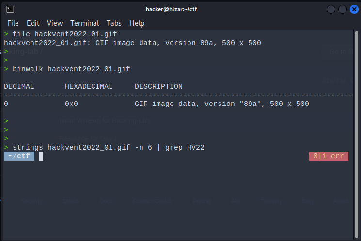
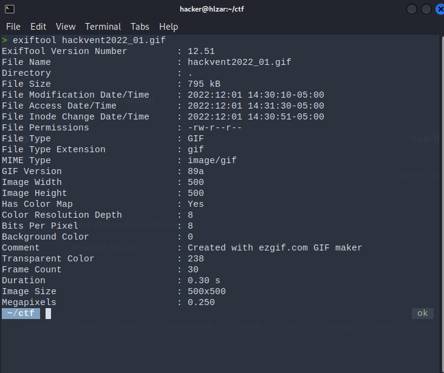
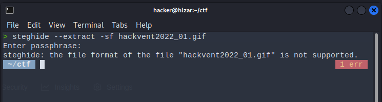
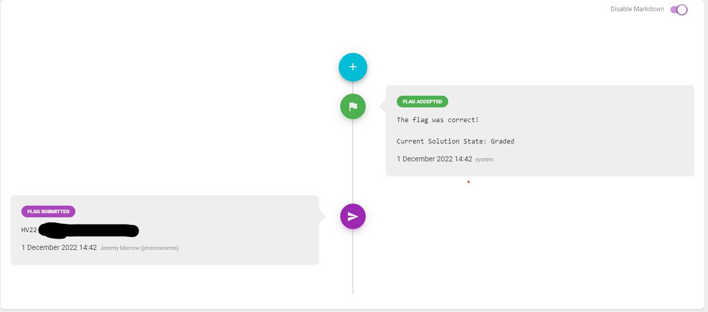

# Day 1 QR means quick reactions, right?

Santa's brother Father Musk just bought out a new decoration factory. He sacked all the developers and tried making his own QR code generator but something seems off with it. Can you try and see what he's done wrong?

You can download the GIF from Resources.

Please validate the following ```sha256sum: 13cd96068652f0453e3e30cf5354ee47a4ea6fe11e379682225471a1b0ad2ff3```

Flag format: ```HV22{}```

I started off by doing some initial investigation of the image provided.

* file to ensure that it was actually a gif
* binwalk to see if there were any extra filetypes
* strings to see if the flag was embedded in the file.  Knowing the flag format, I was able to limit the length of the results as well as grep for the prefix.



Next, I tried to do a little more in-depth photo/stego analysis.

* exiftool to see if there was any relevant metadata
* steghide to see if there was any hidden info.  Not having any hints for the password, I decided to not waste my time and energy going down this rabbit hole just yet.




Having no luck, I finally decided to decode the QR code itself.  This required installing zbar tools:
```sudo apt-get install zbar-tools```

I then ran ```zbarimg``` against the file, which resulted in a decoded list of letters.  Using a combination of ```cut``` and ```sed```, I was able to successfully retrieve the flag.


